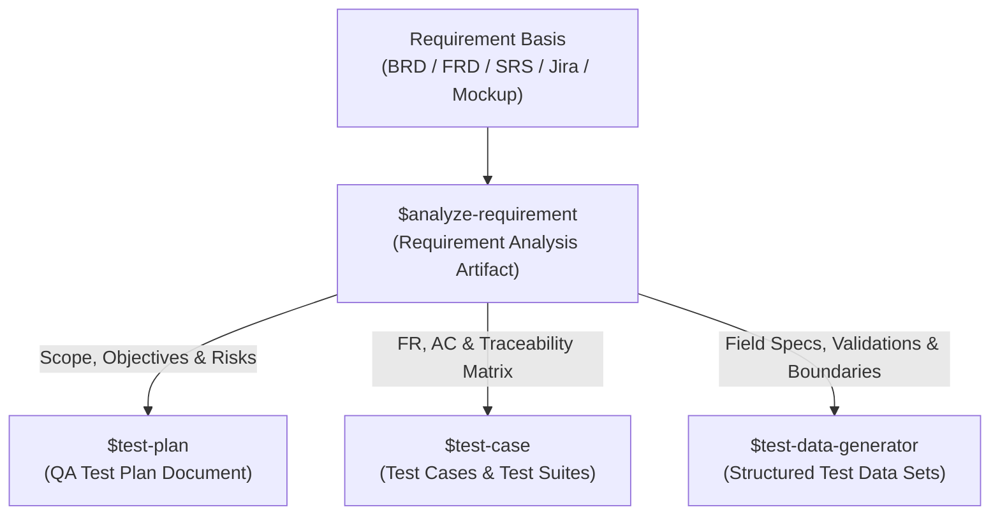

# Workflow: Requirement Document Analysis (Requirement Analyzer)

This skill guides AI to analyze, dissect, and review requirement documents (BRD, FRD, SRS, User Stories, Jira tickets, Wireframes/Mockups) for **any software project** (Web, Mobile, Desktop, API). The skill focuses on clarifying business logic, functional requirements, detailed field specifications, Role-Based Access Control (RBAC) matrices, Traceability Matrices, and detecting risks/ambiguities before testing.

> ⚠️ **IMPORTANT NOTE:** This workflow **DOES NOT generate test cases** — it strictly focuses on decomposition, requirement coverage, business rules extraction, field specifications, traceability, and detecting loopholes in requirements before handing off to Test Planning, Test Case Design, and Test Data Generation.

---

## 1. Input Requirements

The Agent may receive one or more of the following inputs from the User:
1. **Requirement Documents:** Business Requirement Document (BRD), Functional Requirement Document (FRD), Software Requirement Specification (SRS), Jira Ticket, User Story, PRD, or text specification.
2. **UI Mockup / Screenshot / Wireframe (Optional):** Interface design image, Use Case diagram, Figma screenshot, or web page DOM/HTML.
3. **Project Context & Dependencies (Optional):** Related tickets, existing system architecture documents, API contracts, or business notes.

---

## 2. Requirement Quality & Completeness Standards

A high-quality requirement analysis must ensure the following key dimensions are thoroughly captured and evaluated:

1. **Who (Actor & Role):** Clearly identify all user personas, roles, and authorization levels.
2. **Preconditions & Postconditions:** What conditions must exist before execution, and what changes afterwards?
3. **Inputs & Field Constraints:** Clear data boundaries, formats, required/optional states, and trimming rules.
4. **Data State Changes (CRUD):** How entity states mutate across operations (Create, Read, Update, Delete).
5. **Success (Happy) & Alternative Paths:** Step-by-step nominal and secondary execution flows.
6. **Failure & Exception Handling:** Detailed behaviors during validation errors, timeouts, rate limits, network loss, and permission denials.
7. **Business Rules & Calculations:** Explicit formulas, algorithms, threshold rules, and validation logic.
8. **Permissions (RBAC):** UI & API level access control across distinct roles.
9. **Traceability:** Direct link between Business Requirements (BR), Functional Requirements (FR), and Acceptance Criteria (AC).
10. **Downstream Impacts:** Ripple effects on existing modules, APIs, third-party integrations, and databases.

---

## 3. 6-Step Analysis Process (6-Step Workflow)

### Step 1: Context Gathering & Metadata Extraction (Information Gathering & Context)
1. Read the provided requirement document in full.
2. Extract Metadata: Ticket/Requirement ID, Business Requirement Document (BRD), Functional Requirement Document (FRD), Software Requirement Specification (SRS), Feature Name, Module/System, Priority, Related Actors.
3. Identify the overall system context, participating Actors, and affected Modules.

### Step 2: UI Mockup Analysis & Scope Decomposition (UI Analysis & Scope)
If User provides Mockup/Screenshot/DOM:
1. **Layout & Navigation:** Breadcrumbs, Header, Sidebar, Main Content, Footer.
2. **UI Components:** Tables, Form Inputs, Modals, Buttons, Dropdowns, Tabs, Badges.
3. **Scope:** Clearly define what is in scope (**In Scope**) and what is out of scope (**Out of Scope**).

### Step 3: Extract User Stories, Business Requirements & Functional Logic
1. **User Story Format:** Extract standard format: *"As a [Actor], I want to [Action], So that [Value/Goal]"*.
2. **Business Requirements (BR):** Extract core business rules, operational policies, and domain logic.
3. **Functional Requirements (FR) & Acceptance Criteria (AC):**
   - Break down each functional requirement into specific Acceptance Criteria (AC).
   - Group ACs by logical flows (Happy Path, Alternative Flows, Edge Cases, Exception/Failure Flows).
4. **Logic Flow & State Transitions:** Map state lifecycles (e.g. Draft ➔ Submitted ➔ Approved ➔ Rejected) and branching decision logic.

### Step 4: Build Field Specifications & Data Constraints (Field Specs)
Create the detailed **Field Specifications Table**:
- **Field Name / Label**
- **Control / UI Type:** (Input text, Dropdown, Datepicker, Checkbox, Radio, Textarea, File upload, etc.)
- **Required / Optional**
- **Validation Rules & Constraints:** (Min/max length, regex/format, trim spaces, uniqueness, boundary values, date limits, allowed file extensions/sizes)
- **Default Value**
- **Notes / Dependencies**

### Step 5: Construct Traceability Matrix, RBAC & Impact Analysis
1. **Traceability Matrix:** Map every Business Requirement (BR) to Functional Requirements (FR), Acceptance Criteria (AC), and test scope focus.
2. **Permission Matrix (RBAC):** Permission checklist table for each Actor (e.g., Super Admin, Admin, Member, Guest/Public) across CRUD actions.
3. **Downstream Impacts:** Analyze ripple effects on other modules, screens, APIs, databases, or third-party integrations when this feature changes.

### Step 6: Detect Ambiguities (AMB-XX) & Testing Risks (RISK-XX)
> [!IMPORTANT]
> This step delivers critical value — uncovering details NOT explicitly stated, contradictory descriptions, or missing boundary/exception handlers in requirements.

1. **Ambiguities (AMB-XX):**
   - Vague, subjective keywords: *"suitable", "similar", "as needed", "quickly", "etc."*
   - Missing boundary constraints (e.g., undefined max length, missing pagination limit, unstated date ranges).
   - Missing exception handling (e.g., API timeout, server error 500, network drop, concurrent requests).
   - Contradictions between text descriptions and UI mockups.
   - Label as **AMB-01, AMB-02...** with severity level (🔴 High / 🟡 Medium / 🟢 Low) and recommended clarification questions for PO/BA.
2. **Testing Risks (RISK-XX):**
   - Assess risks related to logic conflicts, performance bottlenecks, data integrity, security, or usability.
   - Label as **RISK-01, RISK-02...** with concrete Mitigation Strategies.

---

## 4. Output Template Artifact Structure

Analysis results MUST be exported as a Markdown Artifact (`analysis_report.md` or `requirements_spec_[FEATURE].md`) using the standard general structure below:

```markdown
# 📋 Requirement Analysis Document: [FEATURE NAME / TICKET ID]
> **Project:** [Project Name] | **Module:** [Module Name] | **Analysis Date:** [YYYY-MM-DD]
> **Requirement Basis:** [BRD / FRD / SRS / Jira Ticket / User Story Reference]

---

## 1. Overview & Scope
- **Feature Name / Requirement ID:** ...
- **Business Purpose & Context:** ...
- **Participating Actors / Roles:** [List of Actors / Roles]
- **In Scope:** ...
- **Out of Scope:** ...

---

## 2. User Story & Business Requirements
### 2.1. User Story
> *As a* [Actor], *I want to* [Action], *So that* [Value / Business Goal].

### 2.2. Business Requirements (BR)
- **BR-01:** [Core business rule, policy, calculation formula, domain constraint]
- **BR-02:** [Operational rule, state lifecycle prerequisite]

---

## 3. Functional Requirements & Logic Flow
### 3.1. Functional Requirements (FR) & Acceptance Criteria (AC)
- **FR-01 [Feature / Function Name]:**
  - **Description:** ...
  - **AC-01.1 (Happy Path):** ...
  - **AC-01.2 (Alternative / Edge Flow):** ...
  - **AC-01.3 (Exception / Failure Flow):** ...
- **FR-02 [Feature / Function Name]:**
  - **Description:** ...
  - **AC-02.1 (Happy Path):** ...
  - **AC-02.2 (Exception Flow):** ...

### 3.2. Logic Flow & State Transitions
- **State Transitions:** [e.g., Draft ➔ In Review ➔ Published / Rejected]
- **Error & Exception Handling:** [Behaviors on timeout, network drop, validation failure, rate limit]

---

## 4. Field Specifications
| Field Name (Label) | Control / UI Type | Required | Validation Rules / Constraints | Default Value | Notes / Dependencies |
|---|---|---|---|---|---|
| [Field Name 1] | Text Input | Yes | Min 3, Max 50 chars, trimmed, unique | N/A | Must not duplicate existing records |
| [Field Name 2] | Dropdown | No | Option values: [Option A, Option B, Option C] | Option A | Triggers dynamic field X when Option B selected |
| [Field Name 3] | Datepicker | Yes | Cannot be in past, Format: YYYY-MM-DD | Today | Dependent on Start Date |

---

## 5. Permission Matrix (RBAC) & Downstream Impacts
### 5.1. Role-Based Access Control Matrix (RBAC)
| Action / Feature | [Role 1 / Admin] | [Role 2 / User] | [Role 3 / Guest] |
|---|---|---|---|
| View / Read List | ✅ Allowed | ✅ Allowed | ❌ Denied |
| Create / Edit Record | ✅ Allowed | ❌ Denied | ❌ Denied |
| Delete / Archive | ✅ Allowed | ❌ Denied | ❌ Denied |

### 5.2. Downstream Impacts & Dependencies
- **Impact on Modules / Screens:** [e.g., Updates user profile card in Dashboard]
- **Impact on APIs / Database:** [e.g., New columns added to `users` table, modifies `/api/v1/users` response]
- **Third-Party Services:** [e.g., Payment Gateway webhook, SMS Provider]

---

## 6. Traceability Matrix
| BR ID | Functional Requirement (FR) | Acceptance Criteria (AC) | Coverage / Verification Type | Test Scope Focus |
|---|---|---|---|---|
| BR-01 | FR-01: [Function Name] | AC-01.1, AC-01.2 | Functional / UI Flow | Positive / Happy Path |
| BR-01 | FR-01: [Function Name] | AC-01.3 | Validation / Error Handling | Negative / Boundary |
| BR-02 | FR-02: [Function Name] | AC-02.1, AC-02.2 | Security & Permission | RBAC / State Transition |

---

## 7. Ambiguities & Testing Risks

### 7.1. Ambiguities (AMB-XX)
| AMB ID | Ambiguity / Unclear Point | Impact / Risk if Unresolved | Severity | Recommended Clarification Question for PO/BA |
|---|---|---|---|---|
| AMB-01 | [Detailed description of unclear point] | [Impact if not clarified] | 🔴 High | [Clear question proposing resolution options] |
| AMB-02 | [Vague keyword / missing boundary] | [Inconsistent test behavior] | 🟡 Medium | [Question to confirm boundary specification] |

### 7.2. Testing Risks (RISK-XX)
| RISK ID | Risk Name | Detailed Risk Description | Mitigation Strategy |
|---|---|---|---|
| RISK-01 | [Risk Name] | [Description of logic error, performance, or security risk] | [Concrete test approach to mitigate risk] |
| RISK-02 | ... | ... | ... |

---

## 8. Acceptance Criteria Checklist (QA Execution Baseline)
- [ ] AC-01.1: Verify execution of success flow with valid data.
- [ ] AC-01.2: Verify handling of alternative flows.
- [ ] AC-01.3: Verify Validation error prompt when inputting invalid format or exceeding boundary limits.
- [ ] AC-02.1: Verify role-based access permission enforcement across all User Roles.
```

---

## 5. Strict Rules

1. 🌐 **Language:** Output analysis reports in clear, professional **English** (or match user-specified language).
2. ❌ **NO Test Case Generation:** Strictly DO NOT generate detailed test case steps or execution scripts in this workflow. This skill produces the requirement specification & analysis baseline only.
3. ❌ **NO Logic Guessing:** If the document is unclear, ambiguous, or contradictory, MUST record the issue in the **Ambiguities (AMB-XX)** table for PO/BA clarification rather than making assumptions.
4. ✅ **Full Traceability:** Every Functional Requirement (FR) and Acceptance Criteria (AC) must trace back to Business Requirements (BR) through the **Traceability Matrix**.
5. ✅ **Cross-Domain Generality:** Flexibly apply across all software domains (E-commerce, FinTech, EdTech, CRM, Healthcare, SaaS...) and platforms (Web, Mobile, Desktop, API).

---

## 6. Relationship with Other Testing Workflows (Workflow Integration)

This skill serves as **Phase 1 (Requirement Analysis & Decomposition)** in the end-to-end QA manual testing lifecycle. The generated requirement artifact directly powers and integrates with downstream skills:

| Phase | Downstream Skill | Target Path | Input Provided by this Skill |
|---|---|---|---|
| **Phase 2: Test Planning** | `$test-plan` | `.agents/skills/test-plan` | In/Out Scope, Business Goals, Downstream Impacts, and Testing Risks (RISK-XX). |
| **Phase 3: Test Case Design** | `$test-case` | `.agents/skills/test-case` | Functional Requirements (FR), Acceptance Criteria (AC), Logic Flows, and Traceability Matrix. |
| **Phase 4: Test Data Generation** | `$test-data-generator` | `.agents/skills/test-data-generator` | Field Specifications (Validation Rules, Min/Max Limits, Data Types, Boundary Values, Formats). |


