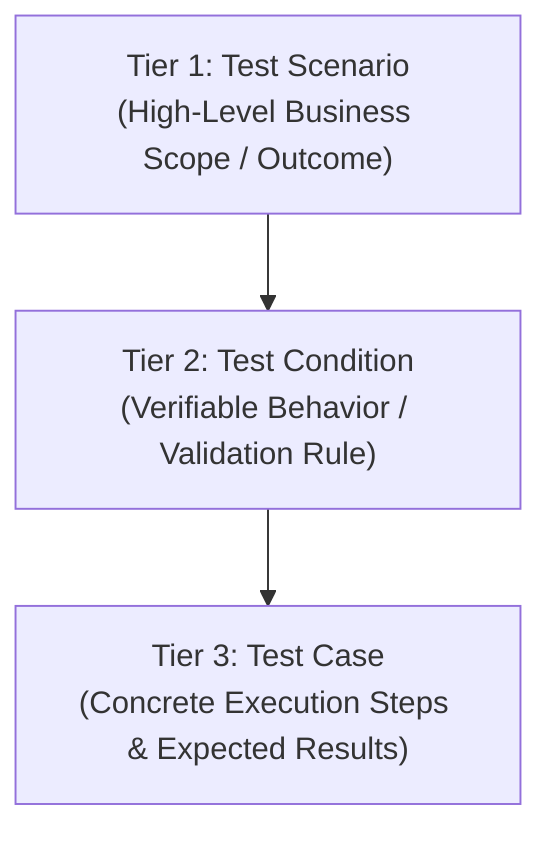
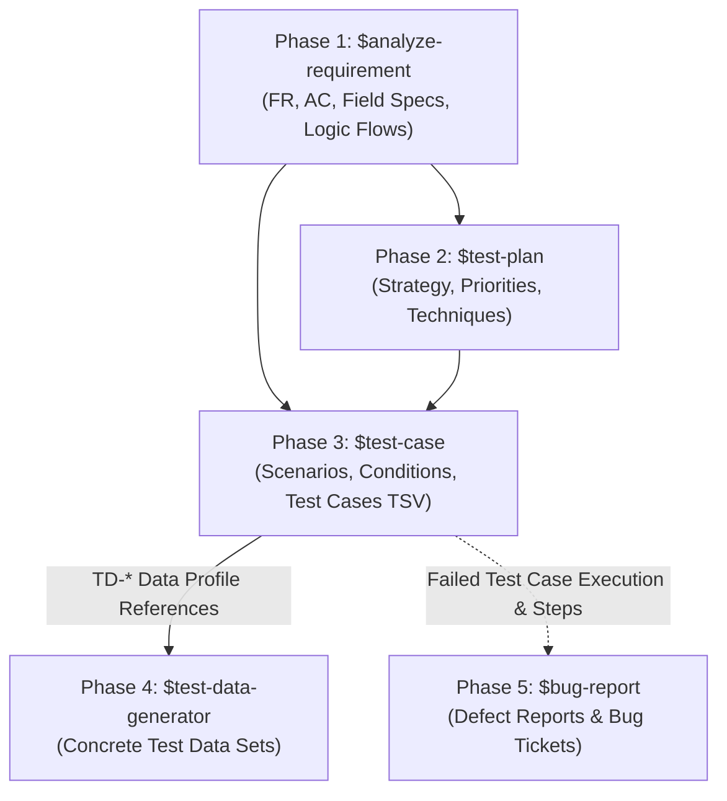

# Workflow: Manual Test Case Design
This skill guides AI to design structured manual test specifications following a strict three-tier hierarchy:

$$\text{Test Scenario} \longrightarrow \text{Test Condition} \longrightarrow \text{Test Case}$$

The final deliverable is a clean, tab-separated values (TSV) execution sheet per feature/screen, ready to be opened directly in any spreadsheet software. Physical layout integrity, row flattening (non-redundant parent metadata), and template column compatibility take absolute priority over renaming or standardizing column headers.

> ⚠️ **IMPORTANT NOTE:** This skill focuses strictly on test logic design and **data profile referencing (`TD-*`)**. It **DOES NOT** fabricate concrete, individual values in `Test Data, Input` (e.g., real emails, dates, strings, mock files, boundary numbers). Detailed test data generation belongs to the downstream `$test-data-generator` skill.

---

## 1. Input Requirements

The Agent may receive one or more of the following inputs from the User:
1. **Requirement Basis:** Business Requirement Document (BRD), Functional Requirement Document (FRD), Software Requirement Specification (SRS), Jira Ticket, User Story, or Requirement Analysis artifact (`$analyze-requirement`).
2. **Test Plan Context:** QA Test Plan (`$test-plan`), Acceptance Criteria (AC), UI/API specifications, or risk assessment matrices.
3. **Existing Scenarios / Conditions:** Pre-existing scenario lists, test conditions, or a reference TSV template to replicate its exact schema and structure.

Identify the target Feature/Screen and existing project ID conventions before generating new identifiers. If business rules are unclear, document concise questions or assumptions. Never invent unconfirmed validation rules or fake test data just to fill out the sheet.

---

## 2. Mandatory 3-Tier Design Flow

Never write test cases without first defining their parent Scenario and Condition. When requirement scope is sufficiently clear, all three tiers can be designed continuously; if the user requests only a specific tier, stop at that tier.



### Tier 1: Test Scenario — High-Level Business Scope

Scenarios represent feature-level or business-outcome scope, not individual fields or UI clicks.

- **Naming Pattern:** `[Business action / featured area] + [high-level outcome]`.
- **Fields:** Assign `Screen`, `Test Scenario ID`, `Test Scenario Name`, and `Test scenarios' Precondition overall`.
- **Grouping Rule:** A single scenario groups multiple test conditions. Do not create separate scenarios merely to split positive and negative test cases.
- **Examples:** `Search and Filter Candidates` or `Add New Candidate`.

### Tier 2: Test Condition — Testable Rule / Behavior

Each condition represents a distinct verifiable behavior, validation rule, or expected state that one or more test cases will validate.

- **Naming Pattern:** `[Object / area] + [behavior, validation or rule]`.
- **Categorization:** Clearly separate conditions across:
  - Valid processing (happy path),
  - Invalid input rejection (negative validation),
  - Empty / zero-result states,
  - Reset, recovery, and cancellation flows,
  - Distinct business rules or calculations.
- **Clarity Rule:** Avoid vague condition names like `Test validation`. Condition names must clearly articulate what is expected to pass or fail.
- **Examples:** `Candidate is created successfully with valid Candidate data` or `System rejects candidate creation when mandatory fields are missing`.

### Tier 3: Test Case — Concrete Verification Instance

Generate specific test cases nested under their corresponding condition. Provide balanced coverage across positive, negative, Boundary Value Analysis (BVA), Equivalence Partitioning (EP), combinatorial, state-transition/recovery, and edge cases applicable to the requirements.

- **Test Case Summary:** Explicitly state the action, target object, and specific condition under test. Do not generically repeat the condition name.
- **Test Preconditions:** State only prerequisites strictly required before executing this case. Do not copy unrelated general requirements.
- **Steps:** Sequential, numbered actions specifying target UI elements/objects, input actions, and data profile reference IDs (`TD-*`).
- **Expected Result:** Observable outcomes (UI feedback, validation messages, API status codes, data persistence or state changes). Numbered to correlate directly with verification steps.
- **Priority:** Strictly use project conventions. When unspecified, default to `High`, `Medium`, `Low`.
- **Execution Notes:** Document the testing perspective and applied design technique, e.g.:  
  `Perspective: Negative | Technique: Boundary Value Analysis (BVA)` or  
  `Perspective: Positive | Technique: Equivalence Partitioning (EP)`.

### Outcome-Based Input Grouping — Avoid Redundant Validation Cases

Do not create one test case per validation input. Group multiple test-data partitions or input variations into **one** test case when every variation can be executed independently and has the same expected behavior outcome.

Group variations only when all of these are true:

- They exercise the same field/object and user action.
- They have the same relevant preconditions and can be reset to a clean state between iterations.
- Each variation is entered and verified independently; a later variation must not depend on a previous one.
- They produce the same observable result, including validation message/rule and data-state outcome.

For a grouped case, use one outcome-oriented summary, one `TD-*` data profile that lists the input partitions (not literal values), and loop through the partitions in the steps. The expected result must state that it applies to **each** independent input. Execution evidence must record the result for every variation and identify the exact failing partition if one fails.

Example for an Email field:

```text
Test Case Summary: Reject invalid Email format inputs
Test Data, Input: TD-CAND-EMAIL-NEG-001 — invalid Email-format partitions: missing separator, missing domain, multiple separators; detailed values supplied by test-data skill.
Steps: 1. For each input partition in TD-CAND-EMAIL-NEG-001, enter one value independently in Email. 2. Submit the form. 3. Verify the validation response and that no record is created. 4. Reset the form and repeat for the next partition.
Expected Result: 1. Each input partition is rejected by the Email validation rule. 2. The defined validation response is displayed. 3. No record is created or changed.
```

Split variations into separate test cases when their expected message, resulting state, precondition, workflow, risk, or required verification differs. Do not group values merely because they belong to the same field.

---

## 3. Test Data & Input Reference Rules

The `Test Data, Input` cell must contain only the identifier and concise description of the **data profile / partition**, NOT literal field values.

### Recommended Pattern
```text
TD-<AREA>-<FUNCTION>-<NNN> — <data profile/partition>; detailed values supplied by test-data skill.
```

### Examples
- ✅ **Valid Reference:**  
  `TD-CAND-ADD-003 — First Name maximum-valid-length partition; detailed values supplied by test-data skill.`
- ❌ **Invalid (Do Not Use Literal Values):**  
  `First Name=Alice; Email=alice@example.com`

Each data reference must trace cleanly to its parent test case and condition. The same `TD-*` reference can be reused across test cases that share the exact same data profile; do not create redundant IDs solely for index increments.

---

## 4. TSV Schema & Row Population Rules

When a reference TSV template is provided, replicate the **exact header row verbatim**, including column ordering, column count, duplicate columns, and original spelling/typos (e.g., retain `Colum 15` if present, preserve blank `Cột n` columns, do not merge identical columns).

When no custom schema is specified, use the canonical 25-column execution schema below (a 24-column version omitting `Cột 6` is also valid if derived from a source template):

```text
Screen
Test Scenario ID
Test Scenario Name
Test scenarios' Precondition overall
Test Condition ID
Test Condition Name
Test Case ID
Test Case Summary
Priority
Test Preconditions
Test Data, Input
Steps
Expected Result
Actual Result 1
Execution Notes
Actual Result 2
```

### Compatibility Columns

| Column | Rule |
|---|---|
| `Actual Result 1`, `Actual Result 2` | When creating new test sheets, fill with `NOT RUN`. Do NOT record `Pass`, `Failed`, or forged execution results. When updating existing sheets, preserve current results. |

### Row Flattening Hierarchy Rules

Each test case occupies exactly **ONE** row. Group all test cases belonging to the same condition contiguously with sequential IDs.

1. **First Test Case Row of a Scenario:** Populate `Screen`, all four Scenario fields (`Screen` through `Test scenarios' Precondition overall`), and the first Condition fields (`Test Condition ID`, `Test Condition Name`).
2. **Subsequent Rows in the Same Scenario:** Leave Scenario metadata fields empty (`Screen` through `Test scenarios' Precondition overall`).
3. **First Test Case Row of a Condition:** Populate `Test Condition ID` and `Test Condition Name`.
4. **Subsequent Rows in the Same Condition:** Leave both Condition fields empty; populate all fields starting from `Test Case ID` onward.

This flattening method cleanly models the parent-child hierarchy in standard spreadsheet viewers without using merged cells and avoids repeating parent metadata on every row.

---

## 5. Identifier Conventions & File Format

Adhere strictly to project-specific ID conventions. If none are specified, use the consistent format below:

- **Test Scenario:** `SCN-<AREA>-<FEATURE>-<NNN>`
- **Test Condition:** `COND-<AREA>-<FEATURE>-<NNN>`
- **Test Case:** `TC-<AREA>-<FEATURE>-<NNN>`
- **Test Data Profile:** `TD-<AREA>-<FEATURE>-<NNN>`

### File Export Specifications
- **Filename Pattern:** `Test sheet for <Feature>.tsv`
- **Delimiter:** Literal tab character (`\t`).
- **Encoding:** UTF-8 without BOM.
- **Header:** Single header line at line 1.
- **Cell Content:** No unescaped internal newline breaks or literal tab characters inside cell content. For multi-step procedures, keep text on a single line using numbered steps (e.g., `1. Navigate to page. 2. Click Submit. 3. Verify error message.`).

---

## 6. Quality Gate Before Delivery

Before completing test case generation, verify the following checklist:

- [ ] **Hierarchical Integrity:** Scenario, condition, and test case IDs are unique, sequential, and follow a strict parent-child relationship.
- [ ] **No Orphaned Records:** Every test case belongs to a condition, and every condition belongs to a scenario.
- [ ] **Row Flattening Compliance:** Scenario/Condition metadata appears only on the first row of their respective groups.
- [ ] **Schema Fidelity:** Headers, column count, duplicate columns, and blank compatibility columns match the target template verbatim.
- [ ] **No Literal Test Data:** All `Test Data, Input` cells reference `TD-*` data profiles, containing no concrete literal test values.
- [ ] **Outcome-Based Grouping:** Input variations with the same independent expected behavior are consolidated in one case; variations with different outcomes or verification needs are separated.
- [ ] **Actionable Content:** Steps, expected results, priorities, and execution notes are clear, concise, and verifiable.
- [ ] **Execution Neutrality:** `Actual Result 1` and `Actual Result 2` are set to `NOT RUN` on newly generated sheets.

---

## 7. Strict Rules

1. 🌐 **Language:** Output all test case specifications, descriptions, and TSV files in professional **English** (or match the user's explicitly requested language).
2. 🧱 **Strict 3-Tier Hierarchy:** Always structure tests via `Test Scenario` → `Test Condition` → `Test Case`. Never generate flat, isolated test cases without their parent Scenario and Condition containers.
3. 🚫 **No Literal Test Data Values:** The `Test Data, Input` column must contain only structured data profile references (`TD-*`). Strictly DO NOT generate concrete test data values (e.g., mock email addresses, sample phone numbers, boundary strings, file payloads). Detailed value generation is exclusively handled by `$test-data-generator`.
4. 📋 **Strict Template & Row Flattening Fidelity:** Preserve header strings, casing, column order, compatibility columns, and column count exactly as specified by the reference template. Follow row flattening rules strictly—never use merged cells or duplicate parent metadata on every row.
5. ⏸️ **No Execution Outcome Fabrication:** On new test sheet creation, set `Actual Result 1` and `Actual Result 2` strictly to `NOT RUN`. Never fake `Pass`, `Fail`, or `Blocked` execution results.
6. 🔗 **Traceability & No Logic Guessing:** Every test condition and case must trace directly back to functional requirements, acceptance criteria, or business rules. Do not invent unconfirmed business logic or validation rules; document any uncertainties as questions or assumptions.
7. 📄 **Clean TSV Formatting:** Ensure the TSV output uses raw tab delimiters, UTF-8 without BOM, a single header row, and single-line cells without unescaped internal newlines or tabs.

---

## 8. Relationship with Other Testing Workflows (Workflow Integration)

This skill represents **Phase 3 (Test Case Design)** in the end-to-end QA manual testing lifecycle. It consumes requirement analysis and test plan strategies, designs structured test specifications, and feeds data requirements into test data generation:

| Phase | Workflow Skill | Target Path | Integration & Interaction with `$test-case` |
|---|---|---|---|
| **Phase 1: Requirement Analysis** | `$analyze-requirement` | `.agents/skills/analyze-requirement` | **Provides to `$test-case`:** Functional Requirements (FR), Acceptance Criteria (AC), Logic Flows, Field Specifications, and Traceability Matrix. |
| **Phase 2: Test Planning** | `$test-plan` | `.agents/skills/test-plan` | **Provides to `$test-case`:** High-risk test areas, prioritized features, applied test design techniques (EP, BVA, State Transition), and entry/exit criteria. |
| **Phase 3: Test Case Design** | `$test-case` *(This Skill)* | `.agents/skills/test-case` | **Produces:** Structured `Test Scenario` → `Test Condition` → `Test Case` execution sheets (TSV) with `TD-*` data profile references. |
| **Phase 4: Test Data Generation** | `$test-data-generator` | `.agents/skills/test-data-generator` | **Receives from `$test-case`:** `TD-*` data profile identifiers and Field Specifications to generate concrete, unique, traceable test datasets (positive, negative, boundary). |
| **Phase 5: Defect Reporting** | `$bug-report` | `.agents/skills/bug-report` | **Receives from `$test-case`:** Failed test steps, actual vs. expected discrepancies, and test case IDs (`TC-*`) when executing tests and reporting bugs. |


