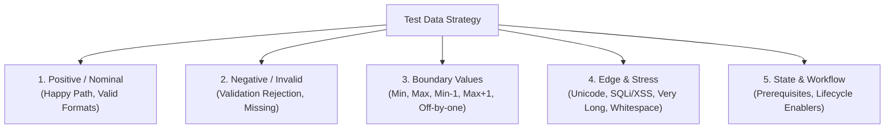
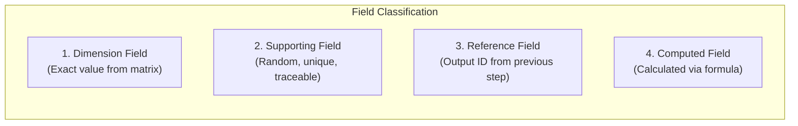
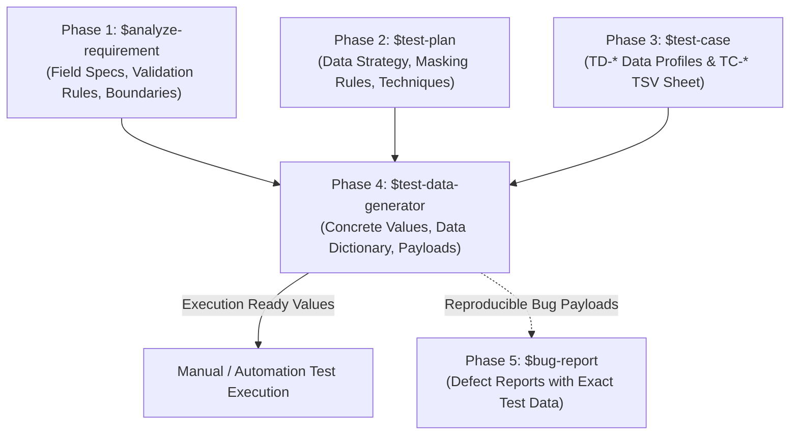

 sql
name: test-data-generator
description: Generate structured, unique, and traceable manual & automated test datasets for test cases designed with $test-case (resolving TD-* profile references), field specifications from $analyze-requirement, and test techniques (BVA, EP, Decision Tables, Pairwise Combinations, Multi-Step Data Chains).
---

# Workflow: Test Data Generation

This skill guides AI to design, calculate, and generate structured, traceable, and realistic test datasets for manual and automated testing. It acts as the concrete data execution layer for test cases designed via `$test-case`, transforming abstract data profile references (`TD-*`) and Field Specifications from `$analyze-requirement` into ready-to-use input values, datasets, API payloads, and execution tables.

> ⚠️ **IMPORTANT NOTE:** This workflow **DOES NOT rewrite test cases or test plans**. It strictly focuses on generating realistic, unique, boundary-accurate, and traceable test data values mapped 1:1 to the `TD-*` (Test Data Profile) references defined in the test case execution sheet.

---

## 1. Input Requirements & Context Ingestion

The Agent must consume and analyze the following inputs:

1. **Test Case Execution Sheet / Specification (`$test-case`):**
   - TSV test sheet or test case documentation containing `TC-*` (Test Case IDs) and `TD-*` (Data Profile References, e.g. `TD-CAND-ADD-003 — First Name maximum-valid-length partition`).
2. **Field Specifications Table (`$analyze-requirement`):**
   - Data types, controls, constraints (min/max length, regex formats, uniqueness rules, required/optional status, allowed file extensions, date boundaries).
3. **Test Strategy & Techniques Context (`$test-plan`):**
   - Applied design techniques (Boundary Value Analysis, Equivalence Partitioning, Decision Tables, State Transitions, Combinatorial/Pairwise matrices) and test data isolation guidelines.
4. **API Schemas / DOM Contracts (Optional):**
   - JSON Request payloads, Swagger/OpenAPI parameters, or UI form structures.

---

## 2. Test Data Taxonomy & Partitioning Principles

To ensure complete verification coverage, test data must be generated across five standard partitions:



### 1. Positive Data (Nominal / Happy Path)
- Realistic, clean, and valid values satisfying all business rules and constraints.
- Complete datasets for required and optional fields.
- Formats adhering strictly to business conventions (e.g., standard phone number, canonical email, standard currency).

### 2. Negative Data (Validation Rejection)
- Missing mandatory fields (null, empty string `""`, unselected dropdowns).
- Incorrect data formats (malformed email `user@domain`, non-numeric characters in phone number, invalid date format).
- Out-of-range values (values below minimum or above maximum limits).
- Violation of uniqueness rules (re-submitting an already existing username, email, or tax ID).
- Unauthorized or forbidden inputs (unsupported dropdown options, invalid enum values).

### 3. Boundary Value Analysis (BVA) Data
For any numeric, string length, date, or collection limit with boundary $[Min, Max]$:
- **Min Boundary:** Exactly $Min$ characters/value.
- **Just Below Min:** $Min - 1$ characters/value (invalid).
- **Just Above Min:** $Min + 1$ characters/value (valid).
- **Max Boundary:** Exactly $Max$ characters/value.
- **Just Below Max:** $Max - 1$ characters/value (valid).
- **Just Above Max:** $Max + 1$ characters/value (invalid).
- **Special Boundaries:** $0$, negative numbers ($-1$), empty string, single character ($1$), leap years (`2028-02-29`), month-end dates (`2026-02-28`).

### 4. Edge Cases, Exotic Characters & Security Payloads
- **Multilingual & Unicode:** Multibyte UTF-8, accented characters (`Nguyễn Văn Ánh`), CJK characters (`山田太郎`, `김철수`), Cyrillic (`Иван`), Arabic (`محمد`), and Emoji symbols (`Test🚀User✨`).
- **Whitespace Handling:** Leading spaces (`"  data"`), trailing spaces (`"data  "`), multiple consecutive internal spaces (`"data   value"`), and newline/tab characters.
- **Special Characters:** Characters with syntactic meaning in code/database (`!@#$%^&*()_+-=[]{}|;':",./<>?` and `' OR '1'='1`).
- **XSS / HTML Sanitization Strings:** `<script>alert('QA')</script>`, ``, `<b>BoldText</b>`.
- **Stress & ReDoS Payloads:** Very long string payloads (e.g., 255, 1,000, or 10,000 repeating characters `A` $\times 10,000$).

### 5. State & Lifecycle Data
- Data required to establish preconditions for specific workflow states (e.g., a pre-seeded `Draft` candidate record, a `Locked` account, an `Expired` token, an `Archived` order).

---

## 3. Data Patterns & Syntax Standards

All generated test data must strictly adhere to three core guarantees: **Uniqueness**, **Traceability**, and **Zero Real PII (Personal Identifiable Information)**.

### Traceable Naming Pattern

```text
test_<entity>_<feature>_<dataProfile>_<timestamp>
```

### Standard Data Type Syntaxes

| Data Type | Generation Pattern / Rule | Examples |
|---|---|---|
| **Email** | `test_<testId>_<profile>_<timestamp>@testqa.internal` | `test_tc01_valid_1712049200@testqa.internal` |
| **Username** | `usr_<feature>_<random/timestamp>` | `usr_cand_849201`, `usr_admin_test` |
| **Full Name** | Standard mock names with traceable tags | `John "QA-Test" Doe`, `Nguyen Van Test` |
| **Phone Number** | Standard regional prefix + deterministic digits | `+84912340001`, `0901234567` |
| **Password** | Mixed complexity (Upper, Lower, Number, Special) | `TestQA#2026!Pass`, `Admin@12345Secure` |
| **Date (Relative)** | Dynamic offset notation relative to Current Date ($T$) | `$T+0$` (Today), `$T+30$` (+30 Days), `$T-1$` (Yesterday) |
| **Date (Literal)** | ISO-8601 formatted strings | `2026-04-15`, `2028-02-29` (Leap year) |
| **Currency / Number** | Exact integer, decimal, zero, or negative numbers | `100000000`, `99.99`, `0`, `-500` |
| **File Upload** | Realistic file names with specified size and extension | `mock_resume_valid_2mb.pdf`, `test_avatar_10mb_oversize.png` |
| **Tax / National ID** | Synthetic unique numbers matching regex rules | `0102030405`, `079201000001` |

> 🛡️ **Zero Real PII Rule:** Never use real customer phone numbers, personal emails, live credit card numbers, or real government identity numbers.

---

## 4. Field Classification & Combinatorial Data Generation

When test cases involve complex multi-variable forms or cross-module business flows, classify each data field into one of four distinct categories:



### Field Classification Matrix

| Field Type | Definition & Purpose | Generation Mechanism |
|---|---|---|
| **Dimension Field** | Values representing parameter variations in a test matrix (e.g., User Role, Payment Method, Tax Type). | **Strictly exact** from the combination matrix — **NEVER randomized**. |
| **Supporting Field** | Mandatory/optional fields needed to complete the form but not part of the variation matrix (e.g., Description, Address, Notes). | Generated with **unique, traceable, mock values**. |
| **Reference Field** | Foreign key, UUID, or transaction code generated by an earlier step/module in a multi-step workflow. | Inherited directly from preceding module output (`{partner_id}`, `{order_id}`). |
| **Computed Field** | Fields calculated by the system based on business formulas (e.g., Tax Amount, Subtotal, Discount). | Calculated exactly according to domain formula and matched with expected output. |

### Multi-Step Data Pipeline (Cross-Module Workflow)

In multi-tiered systems where data cascades across modules (e.g., Partner $\rightarrow$ Payment $\rightarrow$ Tax $\rightarrow$ Invoice Settlement), generate data chains using traceable reference links:

```text
[Module 1: Partner Creation]  --> Outputs: {partner_id: "PTR-001", partner_name: "test_ptr_combo01"}
             ↓ (Reference)
[Module 2: Payment Record]    --> Inputs:  {partner_id: "PTR-001"} | Outputs: {payment_id: "PAY-001", amount: 100000000}
             ↓ (Reference)
[Module 3: Tax Calculation]   --> Inputs:  {payment_id: "PAY-001"} | Formula: Amount * 10% = 10000000
             ↓ (Reference)
[Module 4: Final Settlement]  --> Inputs:  {partner_id, payment_id, tax_amount} | Expected Total: 110000000
```

---

## 5. Standard Output Deliverables & Formats

The Agent must deliver test data in the appropriate format requested by the user or project context:

### Format A: Test Data Dictionary (Markdown Table — Mapped to `$test-case`)

This is the primary deliverable for manual test execution, mapping directly to `TD-*` profile references in the test sheet:

```markdown
# 📊 Test Data Dictionary: [FEATURE NAME]
> **Linked Test Sheet:** `Test sheet for [Feature].tsv` | **Generated Date:** [YYYY-MM-DD]

| Data Ref ID (`TD-*`) | Linked Test Case (`TC-*`) | Field Name | Target Partition / Condition | Concrete Test Value | Expected System Behavior / Validation |
|---|---|---|---|---|---|
| `TD-CAND-ADD-001` | `TC-CAND-ADD-001` | Full Name | Happy Path / Valid Nominal | `John "QA" Smith` | Accepted, trimmed cleanly |
| `TD-CAND-ADD-001` | `TC-CAND-ADD-001` | Email | Happy Path / Valid Standard | `test_cand_add_001_1712049200@testqa.internal` | Accepted |
| `TD-CAND-ADD-001` | `TC-CAND-ADD-001` | Phone | Happy Path / Valid 10-digit | `0912345001` | Accepted |
| `TD-CAND-ADD-002` | `TC-CAND-ADD-002` | Full Name | Negative / Missing Required | `""` (Empty string) | Error: "Full Name is required" |
| `TD-CAND-ADD-003` | `TC-CAND-ADD-003` | Full Name | BVA / Max Length (50 chars) | `Johnathan Alexander Montgomery Richardson The Third` (50) | Accepted exactly at 50 chars |
| `TD-CAND-ADD-004` | `TC-CAND-ADD-004` | Full Name | BVA / Exceed Max (51 chars) | `Johnathan Alexander Montgomery Richardson The Fourth` (51) | Error: "Maximum 50 characters allowed" |
| `TD-CAND-ADD-005` | `TC-CAND-ADD-005` | Email | Negative / Invalid Format | `invalid-email-format@` | Error: "Please enter a valid email" |
| `TD-CAND-ADD-006` | `TC-CAND-ADD-006` | Resume File | Edge / Exceed Size Limit | `oversized_payload_5.1mb.pdf` | Error: "File size exceeds 5MB limit" |
```

### Format B: Structured JSON Dataset (Data-Driven & Automation Fixture)

Used for data-driven testing, API execution, or automated test fixtures:

```json
{
  "feature": "Candidate Management - Add Candidate",
  "data_version": "1.0.0",
  "generated_at": "2026-04-15T10:30:00Z",
  "datasets": [
    {
      "test_data_id": "TD-CAND-ADD-001",
      "test_case_id": "TC-CAND-ADD-001",
      "category": "POSITIVE",
      "description": "Valid candidate creation with standard fields",
      "payload": {
        "fullName": "John QA Smith",
        "email": "test_cand_add_001_1712049200@testqa.internal",
        "phoneNumber": "0912345001",
        "experienceYears": 3,
        "expectedSalary": 25000000,
        "availableDate": "2026-05-01"
      },
      "expected_outcome": {
        "status_code": 201,
        "success": true,
        "message": "Candidate created successfully"
      }
    },
    {
      "test_data_id": "TD-CAND-ADD-005",
      "test_case_id": "TC-CAND-ADD-005",
      "category": "NEGATIVE_VALIDATION",
      "description": "Invalid email format rejection",
      "payload": {
        "fullName": "John QA Smith",
        "email": "invalid-email-string",
        "phoneNumber": "0912345001"
      },
      "expected_outcome": {
        "status_code": 400,
        "success": false,
        "field_errors": {
          "email": "Invalid email address format"
        }
      }
    }
  ]
}
```

### Format C: Combinatorial Matrix Dataset (Pairwise / Cross-Module)

Used when executing multi-dimensional combination tests:

```markdown
### 🧩 Combinatorial Execution Dataset: [Matrix Name]

| Combo ID | Dimension 1 (User Role) | Dimension 2 (Payment Method) | Dimension 3 (Currency) | Supporting Data (Order Ref) | Computed Total | Expected Result / Status |
|---|---|---|---|---|---|---|
| `COMBO-01` | Admin | Credit Card | USD | `ord_combo01_171204` | `$1,050.00` (incl. 5% fee) | Payment Success, Invoice Generated |
| `COMBO-02` | Admin | Bank Transfer | VND | `ord_combo02_171204` | `25,000,000 VND` | Pending Confirmation |
| `COMBO-03` | Member | Credit Card | VND | `ord_combo03_171204` | `26,250,000 VND` (incl. fee) | Payment Success |
| `COMBO-04` | Guest | E-Wallet | USD | `ord_combo04_171204` | `$500.00` | Redirect to Payment Gateway |
```

---

## 6. Quality Gate & Verification Checklist

Before delivering test data, verify all items in the checklist below:

- [ ] **1:1 Traceability:** Every `TD-*` reference from the test case execution sheet (`$test-case`) is resolved with concrete, unambiguous test values.
- [ ] **Zero Real PII:** No actual customer names, live emails, real phone numbers, or production secrets are present.
- [ ] **Boundary Accuracy:** BVA datasets rigorously test exact boundaries ($Min$, $Min-1$, $Min+1$, $Max$, $Max-1$, $Max+1$) per Field Specifications.
- [ ] **Uniqueness & Non-Collision:** Dynamic entities (usernames, emails, codes) include timestamps or random suffixes to prevent database duplicate collision.
- [ ] **Exact Dimension Mapping:** In combinatorial tests, dimension field values match the matrix 100% without arbitrary randomization.
- [ ] **Expected Outcome Included:** Every negative, boundary, or calculated test data item defines its corresponding expected error message, status code, or computed value.

---

## 7. Strict Rules

1. 🌐 **Language:** Output all test data documents, dictionaries, and code fixtures in professional **English** (or match the user's explicitly requested language).
2. 🎯 **Exact `TD-*` Alignment:** Every generated dataset must cleanly trace and map back to the `TD-*` data profile references declared in the `$test-case` TSV sheet and `TC-*` test cases.
3. 🛡️ **Zero Real PII (Absolute Safety):** Under NO circumstances should real personal data, production customer data, real phone numbers, live credit cards, or real system passwords be generated.
4. 🧮 **Exact Boundary & Formula Verification:** Boundary values must strictly match the mathematical bounds ($N-1, N, N+1$) specified in Field Specs. Computed fields must evaluate formulas accurately.
5. 🏷️ **Unique & Traceable Data:** All persistent entity names, emails, and identifiers must follow structured unique naming conventions (`test_<entity>_<profile>_<timestamp>`) to avoid collisions during test runs.
6. 📐 **Dimension Exactness in Combinations:** In combinatorial/matrix data, dimension values must match 100% with the input matrix; never randomize dimension values.
7. 🚫 **No Scope Deviation:** Do not rewrite or modify test case logic, steps, or scenarios; generate only the concrete test data required to execute them.

---

## 8. Relationship with Other Testing Workflows (Workflow Integration)

This skill represents **Phase 4 (Test Data Generation)** in the end-to-end QA manual testing lifecycle. It bridges test case design and physical execution:

| Phase | Workflow Skill | Target Path | Integration & Interaction with `$test-data-generator` |
|---|---|---|---|
| **Phase 1: Requirement Analysis** | `$analyze-requirement` | `.agents/skills/analyze-requirement` | **Provides:** Field Specifications Table (data types, validation regex, min/max lengths, default values, required constraints). |
| **Phase 2: Test Planning** | `$test-plan` | `.agents/skills/test-plan` | **Provides:** Section 2.5 Test Data Approach, privacy rules, data reset strategies, and chosen test design techniques. |
| **Phase 3: Test Case Design** | `$test-case` | `.agents/skills/test-case` | **Provides:** `TD-*` (Test Data Profile) references and `TC-*` test case summaries embedded in the TSV execution sheet. |
| **Phase 4: Test Data Generation** | `$test-data-generator` *(This Skill)* | `.agents/skills/test-data-generator` | **Produces:** Concrete Test Data Dictionaries, JSON datasets, BVA boundary sets, and Combinatorial test data suites. |
| **Phase 5: Defect Reporting** | `$bug-report` | `.agents/skills/bug-report` | **Consumes:** Specific test data values used when reproducing bugs to populate the "Test Data / Payload" section of the bug report. |


