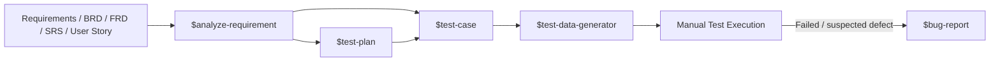
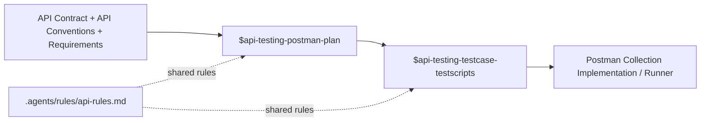

# Manual Testing & API Testing Skills for AI Agents

A reusable collection of **QA / Software Testing skills and rules for AI agents**. The repository provides structured workflows for requirement analysis, test planning, manual test-case design, test-data generation, bug reporting, and Postman API testing.

The goal is to make AI-assisted testing more **traceable, evidence-based, reusable, and consistent** instead of generating ad-hoc test cases from a short prompt.

## What this repository covers

- Requirement analysis from BRD, FRD, SRS, User Stories, Jira tickets, mockups, and related specifications.
- Project-level QA Test Plan generation.
- Requirement-driven manual UI test-case design and suite auditing.
- Traceable `TD-*` test-data contracts and concrete test-data generation.
- Evidence-based bug reports from actual test execution results.
- Postman API test planning, including data-driven validation matrices.
- Execution-ready API test cases and Postman pre-request / post-response scripts.
- Shared API testing rules for assertions, authentication, security, test data, cleanup, HTTP behavior, and OWASP-oriented coverage.

## Workflow overview

### Manual testing workflow



A typical flow is:

1. Analyze the requirement and expose missing rules, ambiguities, risks, field constraints, RBAC, and traceability.
2. Build a project-specific Test Plan.
3. Design or audit the manual functional test suite.
4. Generate concrete data for the `TD-*` profiles referenced by the test cases.
5. Execute the tests manually.
6. Turn verified failures into reproducible bug reports.

### API / Postman workflow



The API workflow deliberately separates **planning** from **implementation-ready test cases and scripts** so that endpoint scope, dependencies, test data, assertions, and traceability remain explicit.

## Available skills

| Skill | Purpose | Main output |
|---|---|---|
| [`$analyze-requirement`](.agents/skills/analyze-requirement/SKILL.md) | Decompose requirements and identify business rules, flows, field specs, RBAC, ambiguities, risks, and traceability | Requirement analysis in Markdown |
| [`$test-plan`](.agents/skills/test-plan/SKILL.md) | Create a project-specific QA Test Plan from supplied project evidence | Test Plan in Markdown |
| [`$test-case`](.agents/skills/test-case/SKILL.md) | Design or audit requirement-driven manual UI test suites | Manual test sheet + `TD-*` test-data contract |
| [`$test-data-generator`](.agents/skills/test-data-generator/SKILL.md) | Resolve `TD-*` profiles into concrete, traceable datasets using BVA, EP, decision tables, pairwise combinations, and workflow data | Test-data dictionary / execution datasets |
| [`$bug-report`](.agents/skills/bug-report/SKILL.md) | Convert failed execution evidence into clear, reproducible defect reports | Bug report(s) in Markdown |
| [`$api-testing-postman-plan`](.agents/skills/api-testing-Postman-plan/SKILL.md) | Design Postman collection topology, test conditions, dependencies, environments, scripts, and data-driven matrices | API Test Plan in Markdown |
| [`$api-testing-testcase-testscripts`](.agents/skills/api-testing-testcase-testscripts/SKILL.md) | Turn the API Test Plan into detailed execution-ready cases and Postman scripts | Test cases in TSV + scripts/instructions in Markdown |

## Shared API testing rules

[`api-rules.md`](.agents/rules/api-rules.md) defines reusable standards for API testing, including:

- separation between API client/service, DTO/model, test, and utility layers;
- exact HTTP status, schema, business-field, error-detail, header, and optional SLA assertions;
- secure token/credential handling and sensitive-data masking;
- dynamic and traceable test data with cleanup/teardown;
- HTTP method and idempotency expectations;
- API security coverage such as BOLA/IDOR, mass assignment, malformed payloads, oversized payloads, rate/resource abuse, race conditions, and sensitive-data exposure.

> The API rules are guidance for test design and automation. Project-specific API contracts and confirmed requirements remain the source of truth for expected behavior.

## Repository structure

```text
.
├── README.md
└── .agents/
    ├── rules/
    │   └── api-rules.md
    └── skills/
        ├── analyze-requirement/
        │   ├── SKILL.md
        │   └── references/
        ├── api-testing-Postman-plan/
        │   ├── SKILL.md
        │   └── references/
        ├── api-testing-testcase-testscripts/
        │   └── SKILL.md
        ├── bug-report/
        │   ├── SKILL.md
        │   └── references/
        ├── test-case/
        │   ├── SKILL.md
        │   ├── references/
        │   └── scripts/
        ├── test-data-generator/
        │   ├── SKILL.md
        │   └── references/
        └── test-plan/
            ├── SKILL.md
            └── references/
```

The `references/` folders contain examples, templates, sample test sheets, and supporting design rules. The `test-case/scripts/` folder contains PowerShell validation utilities for checking test-sheet and test-data-contract structure.

## Quick start

Clone the repository:

```bash
git clone https://github.com/giakhuedz2005-tech/mannual-testing-skill.git
cd mannual-testing-skill
```

To reuse the skills in another project, copy the `.agents` directory into that project's root directory, then use the relevant skill in an AI-agent environment that supports this skill layout.

```bash
cp -R .agents /path/to/your-project/
```

Keep your real project artifacts beside the skills—for example requirements, API contracts, test sheets, and execution results—so the agent can ground its output in actual evidence.

## Example usage

### Analyze a requirement

```text
Use $analyze-requirement to analyze this BRD and UI mockup.
Extract business rules, field specifications, RBAC, traceability,
ambiguities, and testing risks. Do not generate test cases yet.
```

### Build a manual test suite

```text
Use $test-case with the approved requirement analysis and Test Plan.
Design a manual UI functional test suite and create the companion
TD-* test-data contract.
```

### Generate test data

```text
Use $test-data-generator to resolve every TD-* profile in the test sheet
into concrete, unique, traceable test data using the confirmed field constraints.
```

### Create bug reports from execution results

```text
Use $bug-report with the test-case TSV and the actual execution result sheet.
Create reports only for failures supported by real execution evidence.
```

### Plan Postman API testing

```text
Use $api-testing-postman-plan with the API Contract, API Conventions,
and related requirements. Design the Postman collections, environments,
dependencies, test conditions, and any useful data-driven matrices.
```

### Generate API test cases and scripts

```text
Use $api-testing-testcase-testscripts with the approved API Test Plan,
API Contract, and API Conventions. Generate execution-ready TSV test cases
and the required Postman JavaScript scripts.
```

## Design principles

This repository follows several principles across the testing workflow:

- **Evidence before assumptions** — do not invent undocumented validations, status codes, messages, fields, or business behavior.
- **Traceability** — connect requirements, risks, test conditions, test cases, test data, and defects wherever possible.
- **Separation of concerns** — requirement analysis, planning, test design, test data, execution evidence, and defect reporting are different artifacts.
- **Reusable test data** — test cases reference stable `TD-*` profiles; concrete values are generated downstream.
- **Positive + negative + boundary coverage** — coverage should come from the test basis and appropriate test-design techniques, not from arbitrary case counts.
- **Security-conscious API testing** — secrets must not be hardcoded or committed, and security behavior should be tested when supported by the contract and project scope.
- **No fabricated execution evidence** — a generated test specification is not proof that a test was run or that a defect exists.

## Reference artifacts included

The repository currently includes reusable/sample artifacts such as:

- requirement-analysis examples;
- sample Test Plans;
- manual test-sheet templates and feature test sheets;
- test-data contract and delivery rules;
- a sample test-data dictionary;
- bug-report samples;
- Postman API Test Plan examples and data-driven validation guidance;
- PowerShell validators for test-sheet consistency.

These files are intended as **references and examples**, not as a replacement for the current project's requirements or API contract.

## Contributing

When adding or updating a skill:

1. Keep the scope and boundaries of the skill explicit.
2. Define required inputs and expected outputs.
3. Avoid assumptions that are not backed by source documents.
4. Keep handoffs between upstream and downstream skills traceable.
5. Add reference artifacts only when they demonstrate a reusable pattern.
6. Never commit real credentials, access tokens, passwords, or production personal data.

---

Built as a practical QA skill set for using AI as a structured testing assistant rather than a test-case generator with no context.